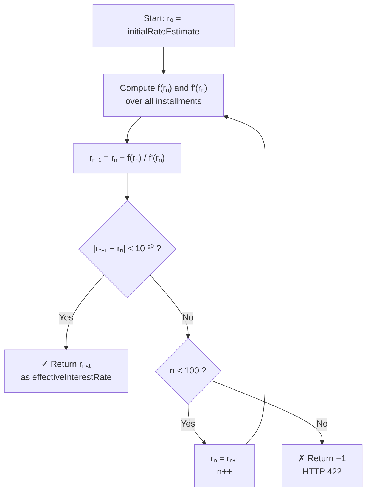
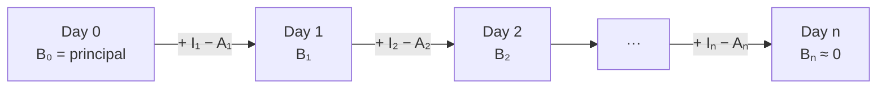

# FinancialCalculation

REST API for loan financial calculations aligned with the [BIAN](https://bian.org) (Banking Industry Architecture Network) data dictionary. Implements two core algorithms from the **Installment Loan** service domain.

---

## Contents

- [Financial Background](#financial-background)
  - [Net Present Value](#net-present-value)
  - [Internal Rate of Return](#internal-rate-of-return-irr)
  - [Newton-Raphson Method](#newton-raphson-method)
  - [Daily Interest Accrual](#daily-interest-accrual)
- [Instrument Examples](#instrument-examples)
  - [Consumer Installment Loan](#1-consumer-installment-loan)
  - [Home Mortgage](#2-home-mortgage)
  - [Corporate Bond — Yield to Maturity](#3-corporate-bond--yield-to-maturity)
  - [Bullet Loan](#4-bullet-loan)
- [API Reference](#api-reference)
- [BIAN Data Dictionary](#bian-data-dictionary)
- [Running](#running)
- [Performance Benchmark](#performance-benchmark)

---

## Financial Background

### Net Present Value

The **Net Present Value (NPV)** of a financial instrument is the sum of all its cash flows discounted to the present at a given interest rate $r$:

$$\text{NPV}(r) = \sum_{k=0}^{n} \frac{CF_k}{(1 + r)^{d_k}}$$

| Symbol | Meaning |
|--------|---------|
| $CF_k$ | Cash flow at installment $k$ — negative for disbursements, positive for repayments |
| $d_k$ | Calendar days elapsed between disbursement date $(d_0 = 0)$ and the due date of installment $k$ |
| $r$ | Daily interest rate |
| $n$ | Number of installments |

> When a loan is fairly priced, its NPV is exactly zero at the contracted rate. Finding that rate is the IRR problem.

---

### Internal Rate of Return (IRR)

The **IRR** is the daily interest rate $r^*$ that makes the NPV equal to zero:

$$\sum_{k=0}^{n} \frac{CF_k}{(1 + r^*)^{d_k}} = 0$$

It answers the question: *"Given this repayment schedule, what is the actual cost of this credit?"*

In practice, IRR is used to:
- Compare the effective cost across different loan products
- Validate whether contracted rates match actual cash flows
- Compute CET (Custo Efetivo Total) required by Brazilian Central Bank regulation
- Price structured credit instruments (debentures, receivables, CRIs/CRAs)

---

### Newton-Raphson Method

The NPV function has no closed-form inverse — the IRR cannot be solved algebraically when $n > 2$. This service uses the **Newton-Raphson** iterative method, which converges quadratically to the root:

$$r_{n+1} = r_n - \frac{f(r_n)}{f'(r_n)}$$

Where $f(r)$ is the NPV function and $f'(r)$ is its first derivative:

$$f(r) = \sum_{k=0}^{n} \frac{CF_k}{(1+r)^{d_k}}$$

$$f'(r) = \sum_{k=1}^{n} \frac{-d_k \cdot CF_k}{(1+r)^{d_k+1}}$$

> Note: the $k=0$ term always contributes $CF_0$ to $f(r)$ and $0$ to $f'(r)$ (since $d_0 = 0$), so the derivative loop starts at $k=1$.

#### Algorithm flow



#### Convergence example — Consumer Loan at 2.5%/month

Starting from `initialRateEstimate = 0.01%/day`:

| Iteration | $r_n$ (daily) | $\text{NPV}(r_n)$ |
|-----------|---------------|-------------------|
| 0 | 0.010000% | +R$ 1,082.45 |
| 1 | 0.062318% | +R$ 214.37 |
| 2 | 0.079801% | +R$ 12.83 |
| 3 | 0.082389% | +R$ 0.04 |
| 4 | 0.082397% | < 10⁻¹² |

**Converges in 4–8 iterations** for typical loan schedules. The quadratic convergence means each iteration roughly doubles the number of correct decimal digits.

#### Rate conversion

Daily rates convert to monthly or annual rates as:

$$r_{\text{monthly}} = (1 + r_{\text{daily}})^{30} - 1$$
$$r_{\text{annual}} = (1 + r_{\text{daily}})^{365} - 1$$

---

### Daily Interest Accrual

Under **accrual-based accounting**, interest income is recognised as it accrues each day — not when cash changes hands. Each day's balance follows:

$$I_t = B_{t-1} \times r_d$$

$$B_t = B_{t-1} + I_t - A_t$$

| Symbol | Meaning |
|--------|---------|
| $I_t$ | `accruedInterestAmount` on day $t$ |
| $B_t$ | `outstandingBalance` at end of day $t$ |
| $r_d$ | `dailyInterestRate` |
| $A_t$ | `amortizationAmount` on day $t$ (non-zero only on payment days) |



The two accrual modes reflect different accounting needs:

| `accrualBasis` | Iterates through | Use case |
|---|---|---|
| `END_OF_PERIOD` | Full schedule end date | Month-end P&L provisioning |
| `INTERMEDIATE_DATE` | Only up to `accrualDate` | Intra-month balance check, early settlement |

---

## Instrument Examples

### 1. Consumer Installment Loan

**Scenario:** personal credit of R$ 10,000 repaid in 6 monthly instalments at 2.5%/month.

**Payment (PMT):**
$$\text{PMT} = PV \times \frac{r}{1 - (1+r)^{-n}} = 10{,}000 \times \frac{0.025}{1 - 1.025^{-6}} \approx R\$\,1{,}831.13$$

**Daily rate:** $(1.025)^{1/30} - 1 \approx 0.082397\%$

**Cash flow timeline:**

```
  +R$10,000
      │
      ▼
   Jan/01 ─────Feb/01 ─────Mar/01 ─────Apr/01 ─────May/01 ─────Jun/01 ─────Jul/01
                  │            │            │            │            │            │
                  ▼            ▼            ▼            ▼            ▼            ▼
              −1,831.13   −1,831.13   −1,831.13   −1,831.13   −1,831.13   −1,831.13
```

**API request (`/irr`):**
```json
{
  "initialRateEstimate": 0.0001,
  "repaymentSchedule": {
    "installmentReference": [0, 1, 2, 3, 4, 5, 6],
    "paymentDueDate": ["2025-01-01","2025-02-01","2025-03-01","2025-04-01","2025-05-01","2025-06-01","2025-07-01"],
    "paymentAmount": [-10000.00, 1831.13, 1831.13, 1831.13, 1831.13, 1831.13, 1831.13]
  }
}
```

**Expected result:** `effectiveInterestRate ≈ 0.00082397` (daily) → **2.5% monthly / 34.97% annually**

---

### 2. Home Mortgage

**Scenario:** real estate financing of R$ 400,000 over 30 years (360 months) at 0.8%/month (SAC or Price system).

**Monthly PMT (Price system — constant instalments):**
$$\text{PMT} = 400{,}000 \times \frac{0.008}{1 - (1.008)^{-360}} \approx R\$\,3{,}213.49$$

**Daily rate:** $(1.008)^{1/30} - 1 \approx 0.026549\%$

**Cash flow timeline (abbreviated):**

```
  +R$400,000
      │
      ▼
   Jan/25 ────Feb/25 ────Mar/25 ─── · · · ───Dec/54 ────Jan/55
                │           │                    │           │
                ▼           ▼                    ▼           ▼
            −3,213.49   −3,213.49            −3,213.49   −3,213.49
              (360 monthly payments totalling R$ 1,156,856)
```

> **Scale of accrual:** a 30-year mortgage has ~10,950 daily accrual records. The `/interest-accrual/summary` endpoint returns only the opening and closing balance, avoiding the O(N) memory cost of storing all daily records — critical at portfolio scale.

---

### 3. Corporate Bond — Yield to Maturity

Bonds invert the typical IRR direction: the **market price** is known and the **yield** (IRR) is what needs to be solved.

**Scenario:** debenture with face value R$ 1,000, 8% annual coupon (semi-annual), 5-year term, trading at R$ 950 in the secondary market.

| Date | Cash flow | Note |
|------|-----------|------|
| Day 0 | −R$ 950.00 | Purchase price (outflow for the investor) |
| Day 180 | +R$ 40.00 | 1st coupon (4% of face, semi-annual) |
| Day 360 | +R$ 40.00 | 2nd coupon |
| ··· | ··· | ··· |
| Day 1,800 | +R$ 1,040.00 | 10th coupon + face value redemption |

**API request (`/irr`):**
```json
{
  "initialRateEstimate": 0.0002,
  "repaymentSchedule": {
    "installmentReference": [0, 1, 2, 3, 4, 5, 6, 7, 8, 9, 10],
    "paymentDueDate": [
      "2025-01-01","2025-07-01","2026-01-01","2026-07-01","2027-01-01",
      "2027-07-01","2028-01-01","2028-07-01","2029-01-01","2029-07-01","2030-01-01"
    ],
    "paymentAmount": [-950.00, 40.00, 40.00, 40.00, 40.00, 40.00, 40.00, 40.00, 40.00, 40.00, 1040.00]
  }
}
```

**Expected result:** `effectiveInterestRate ≈ 0.000238` (daily) → **YTM ≈ 9.1% annually** — higher than the 8% coupon because the bond trades at a discount.

> The IRR of a bond bought at a discount is always higher than its coupon rate. At a premium, it is lower. At par, they are equal.

---

### 4. Bullet Loan

In a bullet (or *balloon*) structure, only interest is paid periodically and the principal is returned in a single payment at maturity — common in interbank lending, CDBs and structured credit.

**Scenario:** R$ 100,000 at 0.05%/day for 90 days.

**Maturity value:**
$$FV = PV \times (1 + r_d)^n = 100{,}000 \times (1.0005)^{90} \approx R\$\,104{,}603.24$$

**Cash flow timeline:**

```
  +R$100,000
      │
      ▼
   Day 0 ─────────────────────────────────────── Day 90
                                                      │
                                                      ▼
                                                −R$104,603.24
                                           (principal + interest)
```

**API request (`/irr`):**
```json
{
  "initialRateEstimate": 0.0004,
  "repaymentSchedule": {
    "installmentReference": [0, 1],
    "paymentDueDate": ["2025-01-01", "2025-04-01"],
    "paymentAmount": [-100000.00, 104603.24]
  }
}
```

**Expected result:** `effectiveInterestRate = 0.00050000...` (daily) — a trivially verifiable case useful for integration testing.

**Accrual of a bullet loan** (`/interest-accrual/detailed`): since there are no intermediate amortisations, `amortizationAmount` is 0 every day except the last, and `outstandingBalance` grows monotonically until maturity.

---

## API Reference

### POST `/irr`

Computes the daily **Effective Interest Rate** for a loan repayment schedule using the Newton-Raphson algorithm.

**Request body:**

```json
{
  "initialRateEstimate": 0.0001,
  "repaymentSchedule": {
    "installmentReference": [0, 1, 2, 3, 4, 5, 6],
    "paymentDueDate": [
      "2024-09-01","2024-10-01","2024-11-01","2024-12-01",
      "2025-01-01","2025-02-01","2025-03-01"
    ],
    "paymentAmount": [
      -5000.00,
      1447.95455883595, 1447.95455883595, 1447.95455883595,
      1447.95455883595, 1447.95455883595, 1447.95455883595
    ]
  }
}
```

| Field | Type | Description |
|-------|------|-------------|
| `initialRateEstimate` | decimal | Starting guess for Newton-Raphson. Use a value close to the expected daily rate (e.g. `0.0001` for low-rate instruments, `0.001` for consumer credit) |
| `repaymentSchedule.installmentReference` | int[] | Sequential installment identifiers |
| `repaymentSchedule.paymentDueDate` | date[] (yyyy-MM-dd) | Due date per installment. Index `[0]` is the disbursement date |
| `repaymentSchedule.paymentAmount` | decimal[] | Cash flow per installment. Index `[0]` must be negative (funds out) |

**Response:**

```json
{ "effectiveInterestRate": 0.00560298075229797650 }
```

> HTTP `422` is returned if the algorithm does not converge within 100 iterations.

---

### POST `/interest-accrual/summary`

Returns only the **opening** and **closing** accrual records — efficient for balance sheet snapshots at portfolio scale.

**Request body:**

```json
{
  "dailyInterestRate": 0.000660305482286683,
  "accrualDate": "2024-10-01",
  "accrualBasis": "END_OF_PERIOD",
  "repaymentSchedule": {
    "installmentReference": [0, 1, 2],
    "paymentDueDate": ["2024-09-01","2024-10-01","2024-11-01"],
    "paymentAmount": [50000.00, 2651.1922386, 2651.1922386]
  }
}
```

| Field | Type | Description |
|-------|------|-------------|
| `dailyInterestRate` | decimal (20 d.p.) | Daily interest rate from the repayment schedule |
| `accrualDate` | date (yyyy-MM-dd) | Target date. Must fall within the schedule period |
| `accrualBasis` | enum | `END_OF_PERIOD` — iterates to the schedule end date · `INTERMEDIATE_DATE` — stops at `accrualDate` |
| `repaymentSchedule` | object | Index `[0]` is the principal disbursement; subsequent entries are repayment installments |

**Response:**
```json
[
  {
    "accrualDaySequence": 0,
    "accruedDate": "2024-09-01",
    "accruedInterestAmount": 0,
    "amortizationAmount": 0,
    "outstandingBalance": 50000.0
  },
  {
    "accrualDaySequence": 61,
    "accruedDate": "2024-11-01",
    "accruedInterestAmount": 32.563482483414937102,
    "amortizationAmount": 2651.1922386,
    "outstandingBalance": 46697.155160511476827
  }
]
```

---

### POST `/interest-accrual/detailed`

Returns an **accrual record for every calendar day** in the period. Same request body as `/interest-accrual/summary`.

| Response field | BIAN term | Description |
|---|---|---|
| `accrualDaySequence` | Accrual Day Sequence | Days elapsed since disbursement |
| `accruedDate` | Accrued Date | Calendar date |
| `accruedInterestAmount` | Accrued Interest Amount | Interest accrued on this day |
| `amortizationAmount` | Amortization Amount | Principal repaid (0 on non-payment days) |
| `outstandingBalance` | Outstanding Balance | Remaining principal balance |

---

## BIAN Data Dictionary

This service aligns with the BIAN **Installment Loan** service domain.

| BIAN Term | Field / Class |
|---|---|
| Loan Repayment Schedule | `repaymentSchedule` (`LoanRepaymentSchedule`) |
| Installment Reference | `installmentReference` |
| Payment Due Date | `paymentDueDate` |
| Payment Amount | `paymentAmount` |
| Effective Interest Rate | `effectiveInterestRate` |
| Interest Accrual Record | `InterestAccrualRecord` |
| Accrued Interest Amount | `accruedInterestAmount` |
| Amortization Amount | `amortizationAmount` |
| Outstanding Balance | `outstandingBalance` |
| Accrual Basis | `accrualBasis` (`AccrualBasis`) |

---

## Running

### Prerequisites

| Tool | Version |
|------|---------|
| Java | 17+ |
| Maven | 3.6+ |
| Docker | 20+ (optional) |

### With Docker (recommended)

```bash
cd AccrualCalculation
docker build -t financial-calculation .
docker run -p 8088:8088 financial-calculation
```

### Locally

```bash
cd AccrualCalculation
mvn spring-boot:run
```

The service starts on **port 8088**.

---

## Performance Benchmark

Run the bundled benchmark to compare execution time and memory allocation across scenarios:

```bash
cd AccrualCalculation
JAVA_HOME=$(/usr/libexec/java_home) mvn compile exec:java
```

Results after the performance optimisations applied in this codebase:

| Scenario | avg time | p95 time | vs unoptimised |
|---|---|---|---|
| IRR — 6 installments | 218 µs | 291 µs | −45% |
| IRR — 120 installments | 1,781 µs | 2,226 µs | −10% |
| Accrual summary — 60 days | 79 µs | 161 µs | −27% |
| Accrual summary — 3,650 days | 978 µs | 1,992 µs | −18% |
| Accrual detailed — 3,650 days | 3,996 µs | 7,607 µs | — |

Full before/after results are saved to `benchmark_results.txt`.

### Key optimisations

| # | Where | What |
|---|---|---|
| 1 | `IrrCalculator` | Day differences pre-computed once before the Newton-Raphson loop |
| 2 | `InterestAccrualCalculation` | Summary endpoint uses O(1) memory — no daily records stored |
| 3 | `InterestAccrualCalculation` | Rolling `previousBalance` variable replaces list lookups |
| 4 | `IrrCalculator` | $k=0$ term skipped in $f'(r)$ — always contributes zero |
| 5 | `IrrController` | Convergence failure detected by sentinel value, not dead null-check |
| 6 | `InterestAccrualRecord` | All-args constructor replaces 5 setter calls per loop iteration |
